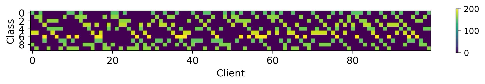
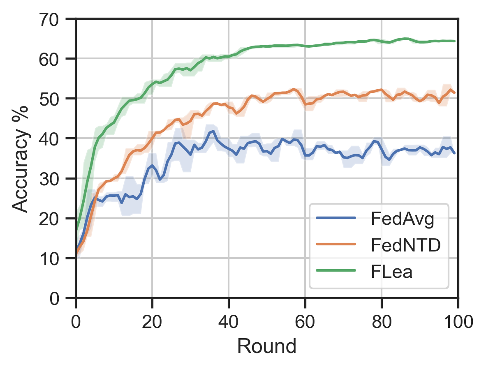

# CodeRepo

This is the code repository for NeurIPS2023 submission #6537 *Sharing Deep Features Safely Improves Federated*
*Learning on Non-IID Data*


### Environment requirements

Python >= 3.6

Torch >= 1.9.0

torchvision >= 0.6.0

torchaudio >= 0.9.0

numpy >= 1.8.1

scikit-learn >= 0.22.1

pandas >= 1.03


### Data

CIFAR10 will be automatically downloaded to `/data/CIFAR10/`

UrbanSound8K can be downloaded from [UrbanSound8K | Kaggle](https://www.kaggle.com/datasets/chrisfilo/urbansound8k) and then unzip under path`/data/UrbanSound8K/audio/`


### Experiments

- To run our method *FLea* on CIFAR10, the following commend can be used 

```
python main.py     --dataset Cifar10 \
                   --split_method quantity \
		   --split_para 3 \
		   --split_num 100 \
		   --client_num 10 \
		   --class_num 10 \
		   --local_epochs 10 \
		   --batch_size 64 \
		   --num_global_iters 100 \
		   --personal_learning_rate 0.001 \
		   --modelname MOBNET \
		   --algorithm FLea \
		   --loss CE_CE_KL \
		   --layer 1 \
		   --fea_percent 0.1 \
		   --seed 0 
```

To compare with *FedAvg*, replace `--algorithm FLea  --loss CE_CE_KL`  by `--algorithm FedAvg` . Additional commands to run *FLea* using different data splits can be found in the directories `run\audio\` and `run\image\`. Baseline implementations are also included in this repository, along with examples of running comments provided in the same path.


- To run our feature-interpolated  *FLea* ,  `is_interpolated` should be set as `True` , for example, 

```
python main.py     --dataset Cifar10 \
                   --split_method quantity \
		   --split_para 3 \
		   --split_num 100 \
		   --client_num 10 \
		   --class_num 10 \
		   --local_epochs 10 \
		   --batch_size 64 \
		   --num_global_iters 100 \
		   --personal_learning_rate 0.001 \
		   --modelname MOBNET \
		   --algorithm FLea \
		   --is_interpolated True \
		   --loss CE_CE_KL \
		   --layer 1 \
		   --fea_percent 0.1 \
		   --seed 0  
```

*A detailed explanation for all comments will be available soon.*


### Evaluation

- Some running logs are saved under `\log_all\`. We visualise the training process of CIFAR10 with Quantity(3) splits as blew,




- Privacy protection evaluation is also provide:
  - Data Reconstruction Attack: `python FLAlgorithms\trainmodel\Test_reconstruction.py`
  - Data Re-identification Attack: `python FLAlgorithms\trainmodel\Test_reidentify.py`
